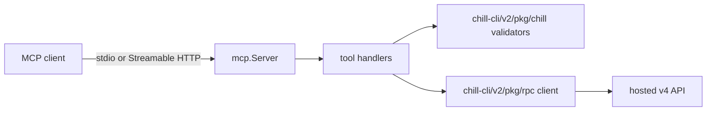
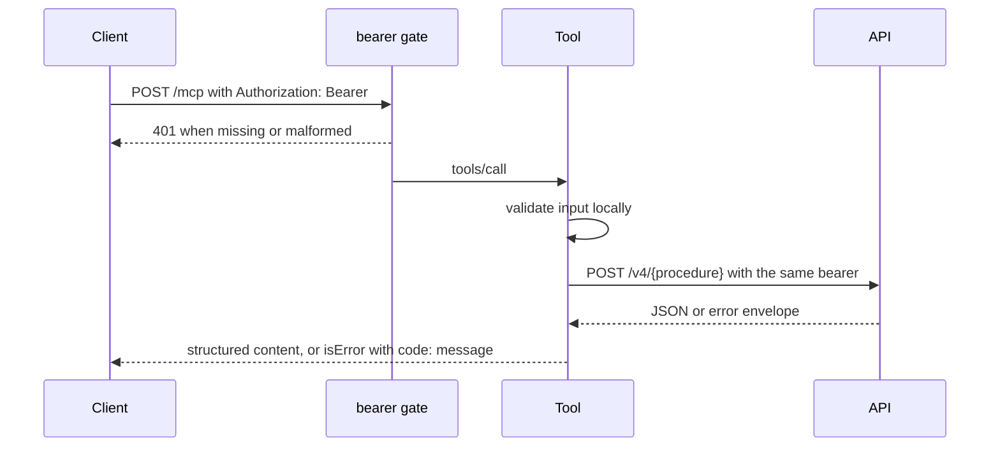

# Architecture

`chill-mcp` turns MCP tool calls into validated calls to the hosted
`chill.institute` API.

## Components

| Path | Owns |
| --- | --- |
| `cmd/chill-mcp/` | Process entrypoint, `stdio`, `http`, `health`, and `version` |
| `internal/server/` | Tool definitions, input validation, API mapping, bearer gate |
| `internal/buildinfo/` | Version and commit injected at link time |
| `Dockerfile` | Non-root distroless image |

Product behavior stays in the hosted API. Procedure names and validators come
from `chill-cli` so the CLI and MCP surfaces cannot drift.

## Request Flow

Requests to the API carry `X-Request-Id`, `X-Chill-Client: mcp`, and the build
version. In `stdio` mode the bearer comes from the `chilly` profile instead of
the request.

## Stateless Transport

The HTTP handler runs the SDK's stateless mode: no `Mcp-Session-Id`, no
server-initiated requests, no event store, `GET` and `DELETE` answer `405`.
Clients negotiate protocol `2026-07-28` or fall back to `2025-11-25`. There is
no OAuth discovery endpoint by design.

## Errors

Validation and API failures are tool results with `isError` and a stable
`code: message` prefix such as `invalid_url:` or `auth_error:`. Protocol errors
are reserved for transport faults. Response bodies are never copied into error
text.

## Delivery

Pull requests run `mise run verify`, `mise run smoke`, and an image build.
Pushes to `main` verify, let semantic-release tag a version and GitHub
release as `chill-ci`, build the image with that version, boot it read-only
with all capabilities dropped, prove health, the version, and the `401` gate,
publish versioned tags to `ghcr.io/chill-institute/chill-mcp`, record the
digest on the release, and dispatch the production deploy with it.
