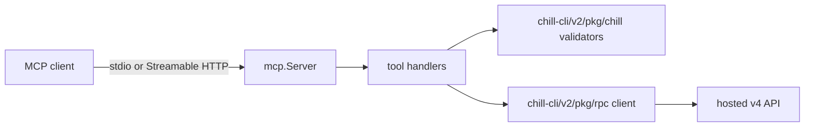
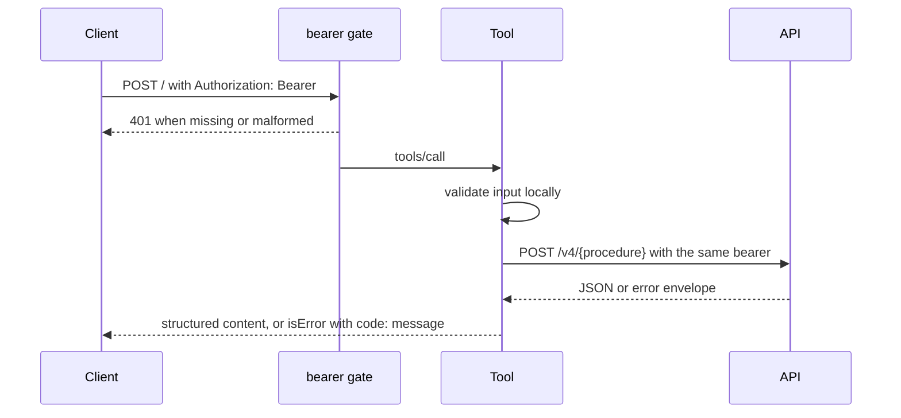

# Architecture

`chill-mcp` turns MCP tool calls into validated calls to the hosted
`chill.institute` API.

## Components

| Path | Owns |
| --- | --- |
| `cmd/chill-mcp/` | Process entrypoint, `stdio`, `http`, `health`, and `version` |
| `internal/server/` | Tool definitions, input validation, API mapping, bearer gate |
| `internal/buildinfo/` | Version and commit injected at link time |
| `Dockerfile` | Non-root distroless image |

Product behavior stays in the hosted API. Procedure names and validators come
from `chill-cli` so the CLI and MCP surfaces cannot drift.

## Request Flow

Requests to the API carry `X-Request-Id`, `X-Chill-Client: mcp`, and the build
version. In `stdio` mode the bearer comes from the `chilly` profile instead of
the request.

## Stateless Transport

The HTTP handler runs the SDK's stateless mode: no `Mcp-Session-Id`, no
server-initiated requests, no event store; with a bearer, `GET` and `DELETE`
answer `405`, and without one every method answers `401`.
Clients negotiate protocol `2026-07-28` or fall back to `2025-11-25`. There is
no OAuth discovery endpoint by design.

## Errors

Validation and API failures are tool results with `isError` and a stable
`code: message` prefix such as `invalid_url:` or `auth_error:`. Protocol errors
are reserved for transport faults. Response bodies are never copied into error
text.

## Delivery

Pull requests run `mise run verify`, `mise run smoke`, and the image proof.
On `main`, after verification, the `release` job runs a semantic-release dry
run to pick the next version. `scripts/image.sh` builds the image once with
that version, boots it read-only with all capabilities dropped, and checks the
version, health, and the `401` gate. Only then does semantic-release tag the
version and create a draft GitHub release as `chill-ci`. The job hands the
proven image to the `publish` job as a `docker save` artifact.

`publish` alone holds package, attestation, and OIDC write permissions and
runs no npm code. It loads the image and fails unless the image ID matches the
proven one. It pushes `:X.Y.Z` and `:sha-<commit>`, attests build provenance to
the registry, records the digest on the release (recreating a missing draft),
and publishes it. The floating tags, the latest-release mark, and the
production deploy move only when the release is the newest `v*` tag on the
`main` tip, so re-running an older run cannot roll them back.
